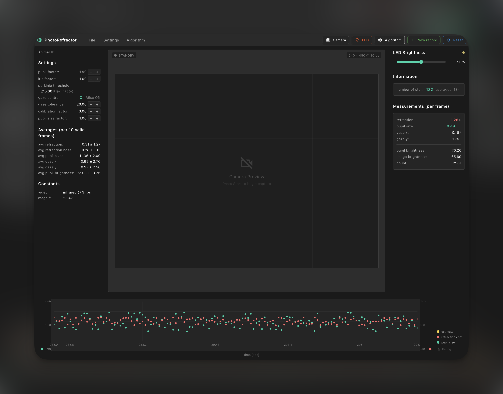

# PhotoRefractor

基于 Flutter 的桌面/移动应用，可运行于 Windows、macOS、Linux、Android、iOS、Web。横屏全屏，支持相机预览、测量数据与实时图表展示，以及 LED 亮度、瞳孔/虹膜参数、普尔钦斑阈值等设置。

**说明**：相机功能依赖官方 `camera` 插件，仅支持 **Android、iOS、Web**；Windows/macOS/Linux 上可正常打包运行，但相机预览不可用。



## 下载安装包

在 [Releases](https://github.com/jingkeling/photo_refractor/releases) 可下载：

- **APK**（Android）
- **Windows 便携版**（zip）
- **Windows 安装程序**（exe）

## 环境要求

- Flutter SDK ^3.10.8
- Dart ^3.10.8

## 获取依赖

```bash
flutter pub get
```

## 运行

```bash
# 调试运行（当前平台）
flutter run

# 指定设备
flutter run -d <device_id>
```

## 打包

### Android (APK)

```bash
flutter build apk --release
```

产物：`build/app/outputs/flutter-apk/app-release.apk`

### Android (App Bundle，推荐上架 Google Play)

```bash
flutter build appbundle --release
```

产物：`build/app/outputs/bundle/release/app-release.aab`

### iOS

```bash
flutter build ios --release
```

随后在 Xcode 中打开 `ios/Runner.xcworkspace`，选择目标设备后 Archive 并导出。

### macOS

```bash
flutter build macos --release
```

产物在 `build/macos/Build/Products/Release/` 下，可打包为 `.app` 或 `.dmg`。

### Windows

```bash
flutter build windows --release
```

产物在 `build/windows/runner/Release/` 下。

### Linux

```bash
flutter build linux --release
```

产物在 `build/linux/x64/release/bundle/` 下。

### Web

```bash
flutter build web --release
```

产物在 `build/web/` 下，可部署到任意静态托管。
